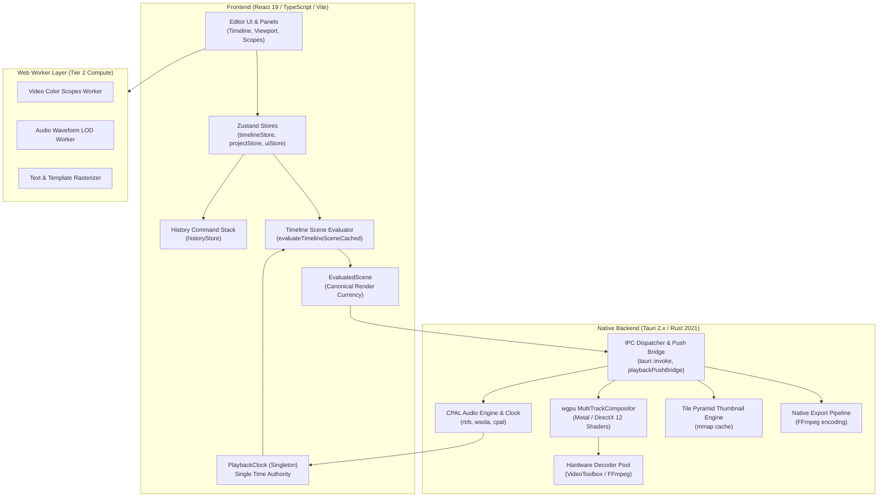

# Clypra Architecture Overview

## 1. System Overview

Clypra is a high-performance desktop non-linear video editor (NLE) built for macOS and Windows.
It combines a reactive TypeScript/React user interface with a native Rust core leveraging hardware video decode, a custom GPU compositor, and low-latency audio hardware clocks.

---

## 2. Major Subsystems & Responsibilities

### 2.1 State & History (`src/store/`, `src/core/history/`)
- **`timelineStore`**: Source of truth for tracks, clips, selections, and timeline zoom/scroll.
- **`projectStore`**: Project file metadata, disk persistence, and save/load lifecycle.
- **`historyStore`**: Undo/redo stack. All timeline mutations must be encapsulated in `Command` objects and dispatched via `historyStore.dispatch()`.
- **`PlaybackClock`**: Process-wide single authority for playback state (`idle`, `playing`, `paused`) and timeline time $T$.

### 2.2 Scene Evaluation (`src/core/evaluation/`)
- Converts track and clip configuration at time $T$ into an immutable `EvaluatedScene`.
- Resolves active clip slices, transform matrices, crop boxes, opacity, transitions, and text templates.
- **Invariant**: All render targets (preview viewport, export pipeline, thumbnail generation, filmstrip cache) consume `EvaluatedScene`. No renderer ever reads `timelineStore` directly.

### 2.3 Preview Render Engine (`src/components/editor/preview/`)
- Dual-mode architecture:
  - **Native Surface (`VITE_CLYPRA_NATIVE_SURFACE=1`)**: Renders directly to a native wgpu Metal (macOS) or DX12 (Windows) window surface.
  - **Web-Canvas Fallback (Default)**: GPU readback frames transferred via Tauri push bridge or WebGL canvas rasterizer.
- Controlled by `NativeProgramPreview.tsx`. Implements closure-based frame scheduling with epoch guards.

### 2.4 Audio Subsystem (`src/core/audio/`, `src-tauri/src/audio/`)
- **Dual Engine**:
  - Web Audio API (`AudioEngine.ts`) for browser/canvas preview fallback.
  - CPAL native audio (`nativeAudioPreviewController.ts` + `audio/mod.rs`) for native preview and playback.
- Synchronizes audio clips to the timeline. When silent projects contain no audio, `markNativeAudioUnavailable()` prevents video playback from stalling on absent hardware clocks.

### 2.5 GPU Compositor & Video Decoder (`src-tauri/src/wgpu_compositor/`, `src-tauri/src/engine/`)
- `wgpu` compositor executes multi-track layer blending, chroma keying, 3D LUT color grading, and video transitions.
- Asynchronous decoder pool decodes H.264/HEVC/ProRes frames via Apple VideoToolbox (macOS) or FFmpeg next (cross-platform).

### 2.6 Native Sidecars & Export (`src-tauri/src/commands/export.rs`, `scripts/`)
- Bundles statically linked FFmpeg and platform sidecars.
- Supports H.264, H.265, WebM, and GIF export with frame batching (`frameBatching.ts`) to maximize throughput.

---

## 3. Dependency Boundaries & Computational Tiers

Clypra enforces the **Three-Layer Rule**:

| Layer | Technology | Responsibilities | Constraints |
|---|---|---|---|
| **Tier 1: Main Thread** | React 19, Zustand, Tauri API | DOM events, UI layout, user gestures, store actions | Must never block $\ge 2\text{ms}$. No synchronous heavy math. |
| **Tier 2: Web Workers** | Web Workers, OffscreenCanvas | Scopes, Waveform LOD, curve math, subtitle parsing | No direct DOM access. No direct Tauri IPC. Pure message passing. |
| **Tier 3: Rust Backend** | Tauri 2.x, Rust, wgpu, CPAL | Hardware video decode, GPU shaders, audio output, disk I/O | Memory safety, zero-copy texture sharing, thread pool isolation. |

---

## 4. Current Areas of Coupling & Testing Implications

During the repository audit, the following coupling points were identified:
1. **Asset Path Hydration Race**:
   `MediaAsset.path` is initially empty (`""`) until database/probe hydration completes (typically 50–100ms after import). Frontend timeline helpers must guard against empty paths before submitting clips to Rust.
2. **Audio Clock Handshake**:
   Video playback in native mode depends on `PlaybackClock.hasNativeClockPosition`. Silent projects or delayed audio initializations require explicit fallback paths (`markNativeAudioUnavailable`) to prevent video playback from hanging on frame 0.
3. **Hardware GPU Requirements for Rust Integration Tests**:
   Several wgpu compositor tests (`tests/multi_track_compositor_tests.rs`, `tests/golden_pixel_tests.rs`) require physical GPU adapters. In headless CI (e.g., standard GitHub Actions Ubuntu runners), these tests are marked `#[ignore]` and run conditionally on GPU-enabled runners.
